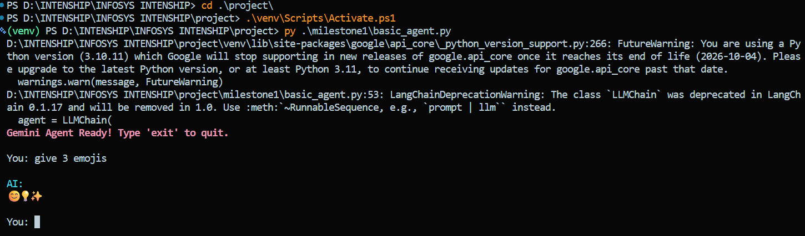
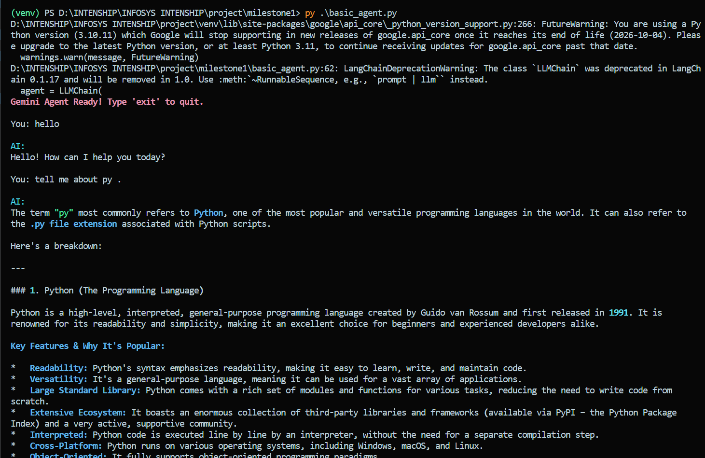

# Milestone 1 – Environment Setup & Basic Agent Creation

This milestone establishes the base setup for the Agent-Orchestration Framework using **LangChain + Gemini**.  
It includes environment setup, a basic single-agent prototype, markdown formatting, and a console-based interface.

---

## 🚀 Objectives Completed

### Week 1
- Set up Python environment  
- Installed LangChain + required libraries  
- Loaded `.env` for Gemini API key  
- Connected to Gemini using `ChatGoogleGenerativeAI`  
- Built initial LLM agent  

### Week 2
- Created `PromptTemplate`  
- Implemented `LLMChain`  
- Added custom markdown parser (bold + italic)  
- Built interactive console chat interface  

---

## Features Implemented

- Gemini-powered LangChain Agent  
- Prompt-based response system  
- Real-time console interaction  
- Custom markdown → Rich CLI formatting  
- Clean modular Python structure  

---

## 📸 Output Screenshots

### **Agent Startup**

### **AI Response Example**

(Replace these images with your real screenshots inside `output/`)

---

## 📌 Summary

Milestone 1 is **fully completed** and includes:
- Full environment setup  
- A working LangChain + Gemini agent  
- Console-based interaction system  
- Markdown-enhanced output formatting  

---

