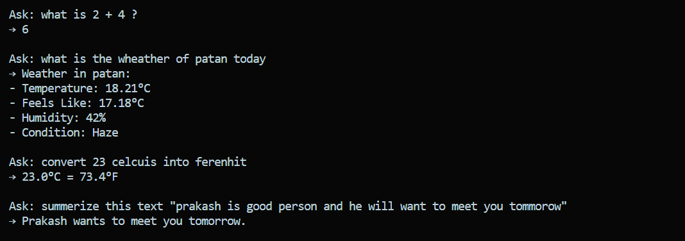

# Milestone 2 – Tool Integration & API Calling

This milestone represents a significant enhancement to the Agent-Orchestration Framework, successfully integrating **custom tools** into the **LangChain + Gemini agent**. The agent is now equipped with the capability to perform calculations, summarization, external API lookup, and conversion—using **structured tool invocation**.

---

## 🚀 Objectives Completed

### Week 3
* **Understood LangChain’s Tool abstraction**
* **Implemented multiple custom tools:**
    * Calculator Tool
    * Temperature Converter Tool
    * Summarizer Tool
    * Weather Tool (Real API)
    * Currency Converter Tool
* **Integrated tools into the agent context**
* **Established a clean modular `tools/` folder structure**

### Week 4
* **Designed prompts** that guide Gemini to select tools automatically
* **Implemented tool-call parsing** inside the agent
* **Added robust error handling for:**
    * Invalid inputs
    * Weather API failures
    * Incorrect units & currencies
* **Successfully tested multiple tool-interaction scenarios**
* **Demonstrated agent → tool → agent workflow** in console-based interface

---

## 🧰 Tools Implemented (5 Total)

Five custom tools were successfully implemented, significantly exceeding the minimum requirement of two.

| Tool Name | Description | Key Technology |
| :--- | :--- | :--- |
| **Calculator Tool** | Parses math expressions and returns computed results. | Internal Python Logic |
| **Summarizer Tool** | Powered by Gemini for concise text summarization. | Gemini LLM Call |
| **Weather Tool** | Fetches real-time weather via **OpenWeatherMap API**. | External API (`requests`) |
| **Temperature Converter Tool** | Converts Celsius ($\text{C}$) $\leftrightarrow$ Fahrenheit ($\text{F}$) $\leftrightarrow$ Kelvin ($\text{K}$). | Internal Python Logic |

---

## ✨ Features Implemented

* **Gemini-powered LangChain agent with tool routing capability**
* **Automatic decision-making** for tool use
* **Modular and scalable Python structure** (`tools/`)
* **Real external API integration** (Weather API)
* **Clean error-handling** for invalid user queries
* **Console-based tool testing** and user interaction

---

## 📸 Output Screenshots

### **AI Response Example**

---

## 📌 Summary

Milestone 2 is **fully completed** and includes:

* **Full tool abstraction and integration**
* **Agent-controlled tool selection** using Gemini
* **Five operational tools** (Calculator, Summarizer, Weather API, Temperature Converter, Currency Converter)
* **Reliable error handling** for all tool types
* **Complete demonstration of agent-tool interaction**

---